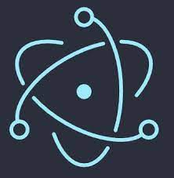

# Electron桌面应用实战



> 如果你可以建一个网站，你就可以建一个桌面应用程序。

## Electron 简介

Electron 可以让你使用纯 JavaScript 调用丰富的原生 APIs 来创造桌面应用。你可以把它看作是专注于桌面应用而不是 web 服务器的，io.js 的一个变体。

这不意味着 Electron 是绑定了 GUI 库的 JavaScript。相反，Electron 使用 web 页面作为它的 GUI，所以你能把它看作成一个被 JavaScript 控制的，精简版的 Chromium 浏览器。

官网: [electronjs.org](https://www.electronjs.org/)  

### 使用Electron的软件

有成千上万的桌面应用使用Electron来构建  
最有名的是微软的vscode,Github的Atom,Facebook Messenger  

* 版本控制: Github Desktop
* 接口调试: Postman
* 编辑器: vscode,atom
* 聊天软件: Facebook Messenger, Whatsapp
* 游戏直播: Twitch
* 游戏引擎: unity启动器
* Markdown: Typora
* 绘图软件: 新版XMind,Draw.io
* 下载软件: 新版迅雷

更多app可以查询官网: https://www.electronjs.org/apps

### 优点

* 门槛低,跨平台
* 开发简单快速
* 能使用成千上万的前端组件
* 适合UI展示类及简单应用类,如工作中有桌面端需求的可以使用Electron快速开发
* 开源，更新快，社区活跃,文档查阅方便

### 缺点

* 打包体积大
* 启动速度慢
* 运行效率不如wpf,qt等应用效率高

### 需要环境及工具

* Windows/Mac OS/Linux
* npm/yarn
* 趁手的编辑器

## 实战示例

1. 实战1 简单入门: 做一个 todo list
2. 实战2 使用react: 做一个五子棋

#### 如何安装

```zsh
npm init
npm i -D electron@latest
```

##### 安装问题

如果npm太慢的使用淘宝镜像  
npm config set registry https://registry.npm.taobao.org  
恢复npm  
npm config set registry https://registry.npmjs.org  

如果electron安装太慢  
npm config edit  
在配置文件中增加  
electron_mirror=https://cdn.npm.taobao.org/dist/electron/ 

#### 快速上手 

可参考官方的快速启动项目

```zsh
git clone https://github.com/electron/electron-quick-start

cd electron-quick-start

npm install && npm start
```

#### 基本概念

##### 进程

Electron分为两个进程: 主进程和渲染进程  
主进程: 相当于普通的node脚本
渲染进程: web页面

##### 如何引入Electron模块

```js
const electron = require('electron')
const { app, BrowserWindow } = electron

let win

app.whenReady().then(() => {
  win = new BrowserWindow()
  win.loadURL('https://github.com')
})
```

##### 如何打包Electron程序

使用`Electron Forge`  
```zsh
npm install --save-dev @electron-forge/cli

npx electron-forge import

npm run make

# 进入编译目录out
open ./out
```

### 实战1 简单入门: 做一个 todo list

让我们先实战做一个简单的todo app  

1. 创建项目  

```zsh
# yarn
yarn create electron-app todo
# 或 npx
npx create-electron-app todo
```

2. 加入我们需要的一些依赖

```zsh
yarn add lodash 
yarn add jquery^3.3.1
yarn add bootstrap^4.1.3
yarn add popper.js
yarn add flatpickr
yarn add @forevolve/bootstrap-dark
yarn add node-schedule
```

3. 编写界面和基本功能

修改一下index.js
```js
// Create the browser window.
const mainWindow = new BrowserWindow({
  width: 400,
  height: 600,
  webPreferences: {
    // 默认，启用上下文隔离
    contextIsolation: true,
    // 默认，不在页面中使用node
    nodeIntegration: false,
  }
});
```

引入样式  
```html
<link rel="stylesheet" href="../node_modules/bootstrap/dist/css/bootstrap.min.css">
<link rel="stylesheet" href="../node_modules/flatpickr/dist/flatpickr.min.css">
```

引入一些js
```html
<script src="../node_modules/lodash/lodash.min.js"></script>
<script src="../node_modules/jquery/dist/jquery.min.js"></script>
<script src="../node_modules/bootstrap/dist/js/bootstrap.min.js"></script>
<script src="../node_modules/flatpickr/dist/flatpickr.min.js"></script>
```

写页面
index.html  
```html
<h1>todo app</h1>
<p>This is a todo application.</p>
<div class="btn-group todo-btn-group">
  <button class="btn btn-primary" id="add_task">添加任务</button>
  <button class="btn btn-success" id="complete_task">完成任务</button>
  <button class="btn btn-danger" id="delete_task">删除任务</button>
</div>
<div class="list-group todo-list-group">
</div>
<div class="modal" id="modal_task_detail">
  <div class="modal-dialog modal-dialog-centered">
    <div class="modal-content">
      <div class="modal-header">
        <h5 class="modal-title">添加任务</h5>
        <button type="button" class="close" data-dismiss="modal" aria-label="Close">
          <span aria-hidden="true">&times;</span>
        </button>
      </div>
      <div class="modal-body">
        <p>
        <div>
          <form action="">
            <div class="form-group">
              <label for="title" class="col-form-label">标题</label>
              <input type="text" class="form-control" name="title" id="title">
            </div>
            <div class="form-group">
              <label for="time" class="col-form-label">时间</label>
              <input type="text" class="form-control" name="time" id="time">
            </div>
          </form>
        </div>
        </p>
      </div>
      <div class="modal-footer">
        <button type="button" class="btn btn-secondary" data-dismiss="modal">关闭</button>
        <button type="button" class="btn btn-primary" id="modal_task_detail_btn">添加</button>
      </div>
    </div>
  </div>
</div>
<div class="modal" tabindex="-1" id="modal_confirm_delete">
  <div class="modal-dialog modal-dialog-centered">
    <div class="modal-content">
      <div class="modal-header">
        <h5 class="modal-title">确认删除</h5>
        <button type="button" class="close" data-dismiss="modal" aria-label="Close">
          <span aria-hidden="true">&times;</span>
        </button>
      </div>
      <div class="modal-body">
        <p>确认要删除此任务吗?</p>
      </div>
      <div class="modal-footer">
        <button type="button" class="btn btn-secondary" data-dismiss="modal">关闭</button>
        <button type="button" class="btn btn-danger" id="modal_confrim_delete_btn">删除</button>
      </div>
    </div>
  </div>
</div>
```

写一些基础css  
```css
body {
  font-family: -apple-system, BlinkMacSystemFont, "Segoe UI", Roboto, Helvetica, Arial, sans-serif;
  margin: auto;
  max-width: 38rem;
  padding: 2rem;
}

.todo-btn-group {
  margin-bottom: 10px;
  width: 100%;
}

.todo-list-group {
  height: 330px;
  overflow: auto;
}

.overline {
  text-decoration: line-through !important;
}
```

完成TODO的基础功能
```js
// 当前选择任务
let currentTask = null

// 所有任务, 任务状态: active:激活 , completed:完成
let tasks = [
  { id: _.uniqueId(), time: '07:00', state: 'completed', title: '吃早饭' },
  { id: _.uniqueId(), time: '08:00', state: 'active', title: '学习electron' },
  { id: _.uniqueId(), time: '11:30', state: 'active', title: '吃午饭' },
  { id: _.uniqueId(), time: '13:00', state: 'active', title: '学习react' },
  { id: _.uniqueId(), time: '15:00', state: 'active', title: '学习vue' },
  { id: _.uniqueId(), time: '18:00', state: 'active', title: '吃晚饭' },
  { id: _.uniqueId(), time: '22:00', state: 'active', title: '睡觉' },
]

$(() => {
  flatpickr("#time", { enableTime: true, noCalendar: true, dateFormat: 'H:i' });

  renderList()

  // 点击添加任务
  $('#add_task').click((event) => {
    $('#title').val('');
    $('#time').val('');
    $('#modal_task_detail').modal({})
  })

  // 确认添加任务
  $('#modal_task_detail_btn').click((event) => {
    const time = $('#time').val()
    const title = $('#title').val()
    if (!time || !title) {
      alert('请填写内容')
      return
    }
    tasks.push({ id: _.uniqueId(), time: time, title: title, state: 'active' })
    tasks = _.orderBy(tasks, ['time', 'asc'])
    renderList()
    $('#modal_task_detail').modal('hide')
  })

  // 点击完成任务
  $('#complete_task').click((event) => {
    if (!currentTask || currentTask.state !== 'active') {
      alert('请选择任务');
      return
    }
    const finded = _.find(tasks, { id: currentTask.id })
    if (finded) {
      finded.state = 'completed'
      renderList()
    }
  })

  // 点击删除任务
  $('#delete_task').click((event) => {
    if (!currentTask) {
      alert('请选择任务');
      return
    }
    $('#modal_confirm_delete').modal({})
  })

  // 确认删除
  $('#modal_confrim_delete_btn').click(() => {
    if (!currentTask) {
      alert('请选择任务');
      return
    }
    const finded = _.find(tasks, { id: currentTask.id })
    if (finded) {
      _.remove(tasks, it => it.id == currentTask.id)
      renderList()
      $('#modal_confirm_delete').modal('hide')
    }
  })

})

// 渲染列表, 绑定事件
const renderList = async () => {
  $('.todo-list-group').html(
    tasks.map(it => $(`<a href="#" data-id="${it.id}"
        class="list-group-item list-group-item-action ${it.state === 'completed' ? 'overline' : ''}">
          [${it.time}]${it.title}</a>`))
  )

  $('.todo-list-group a').click((event) => {
    $('.todo-list-group a').removeClass('active')
    const $target = $(event.currentTarget)
    const finded = _.find(tasks, { id: $target.attr('data-id') })
    currentTask = finded
    $target.addClass('active')
  })

  currentTask = null
}

```

4. 加入一些功能

#### 黑暗模式  

要点:  
1. 使用nativeTheme模块中的两个参数`shouldUseDarkColors`,`themeSource`,判断系统的主题  
2. 渲染进程通过`ipcMain`模块和主进程进行同行

修改下我们的index.js
```js
const { app, BrowserWindow, ipcMain, nativeTheme} = require('electron');

const createWindow = (isInit=false) => {
  // Create the browser window.
  const mainWindow = new BrowserWindow({
    width: 400,
    height: 600,
    webPreferences: {
      // 默认，启用上下文隔离
      contextIsolation: true,
      // 默认，不在页面中使用node
      nodeIntegration: false,
      // 预加载脚本
      preload: path.join(__dirname, 'preload.js')
    }
  });

  // and load the index.html of the app.
  mainWindow.loadFile(path.join(__dirname, 'index.html'));

  if (isInit) {
    ipcMain.handle('dark-mode:toggle', () => {
      if (nativeTheme.shouldUseDarkColors) {
        nativeTheme.themeSource = 'light'
      } else {
        nativeTheme.themeSource = 'dark'
      }
      return nativeTheme.shouldUseDarkColors
    })

    ipcMain.handle('dark-mode:shouldUseDarkColors', () => {
      return nativeTheme.shouldUseDarkColors
    })
  }

};

app.on('ready', ()=>createWindow(true));

```

在preload.js中暴露远程方法给渲染进程  
preload.js
```js
const { contextBridge, ipcRenderer } = require('electron')
contextBridge.exposeInMainWorld('darkMode', {
  toggle: () => ipcRenderer.invoke('dark-mode:toggle'),
  shouldUseDarkColors: () => ipcRenderer.invoke('dark-mode:shouldUseDarkColors')
})
```

在前台中调用及设置主题  

黑暗模式样式  
```html
<link rel="stylesheet" href="../node_modules/@forevolve/bootstrap-dark/dist/css/bootstrap-light.min.css">
<link rel="stylesheet" href="../node_modules/@forevolve/bootstrap-dark/dist/css/bootstrap-prefers-dark.min.css">
```

加个按钮
```html
<button class="btn btn-secondary" id="dark_mode_toggle">主题</button>
```

```js
let theme = 'Light';

    $(() => {
      // ...

      // 切换黑暗模式
      $('#dark_mode_toggle').click(async ()=>{
        const isDarkMode = await window.darkMode.toggle()
        theme = isDarkMode ? 'Dark' : 'Light'
        $('#dark_mode_toggle').html('主题:'+(theme==='Dark'?'暗':'亮️'))
      })

    })

    $(async ()=>{
      // 设置系统默认主题色
      const isDarkMode = await window.darkMode.shouldUseDarkColors()
      theme = isDarkMode ? 'Dark' : 'Light'
      $('#dark_mode_toggle').html('主题:'+(theme==='Dark'?'暗':'亮️'))
    })

```

#### 增加桌面通知

要点:  
使用`Notification`模块进行通知的发送  

index.js  
```js
let jobs = []

const createWindow = (isInit=false) => {
  // ... 
  
  // 设置定时通知
  ipcMain.handle('notification:setAll', (_, tasks) => {
    // 清除原有设置通知
    jobs.forEach(job => job?.cancel())
    jobs = []
    if (tasks && tasks.length > 0) {
      tasks.forEach(task => {
        const date = new Date()
        date.setHours(task.time.split(':')[0])
        date.setMinutes(task.time.split(':')[1])
        date.setSeconds(0)
        jobs.push(schedule.scheduleJob(date, () => {
          new Notification({ title: task.title, body: '已经到时间了' }).show()
        }));
      });
    }
  })
}
```

在preload.js中也暴露方法给渲染进程  
```js
contextBridge.exposeInMainWorld('notification', {
  setAll: (tasks) => ipcRenderer.invoke('notification:setAll', tasks),
})
```

5. 编译&完成

```zsh
yarn make
```

### 实战2 使用vue: 做一个五子棋

让我们再来一个app,做个五子棋，顺便复习下上节课的vue  

1. 创建项目  

安装  
```zsh
npm install -g @vue/cli
# OR
yarn global add @vue/cli
```

创建vue项目:  
```zsh
vue create five_chess
```


添加cli模板:  
```zsh
cd five_chess
vue add electron-builder
```

之前Electron中使用vue已有一套现成的方案:  
可参见[electron-vue](https://simulatedgreg.gitbooks.io/electron-vue/content/cn/)  
包含webpack,vuex等功能，这里则使用vue-cli的[vue-cli-plugin-electron-builder](https://github.com/nklayman/vue-cli-plugin-electron-builder)模板插件进行搭建。  

运行一下 看下效果  
```zsh
yarn electron:serve
```

2. 加入我们需要的一些依赖

```zsh
yarn add lodash 
vue add vue-cli-plugin-element-plus
```

3. 先想一下需要哪些组件

组件结构类似如下:  
```
-- App.vue
  |-- Game.vue 整个游戏界面
     |-- GameUi.vue 包含游戏操作内容
     |-- Board.vue 棋板
        |--  Square.vue 棋格
     |-- Status.vue 显示游戏状态栏,包含步数等信息
```

4. 编写界面和基础功能

首先新建上述的vue组件,并修改下background.js中的窗口大小  

```js
const win = new BrowserWindow({
  width: 500,
  height: 600,
})
```

另外element-plus插件默认的按钮修改过颜色，注释一下改回原来的颜色  
element-variables.scss  
```scss
/* $--color-primary: hotpink; */
```

开始写app.vue  
```html
<template>
  <game></game>
</template>

<script>
import Game from './components/Game.vue'

export default {
  name: 'App',
  components: {
    Game
  }
}
</script>
```

在Game组件中列出基本布局,和需要的数据  
Game.vue
```html
<template>
  <div>
    <game-ui></game-ui>
    <board
      :squares="boardSquares"
    ></board>
    <status :step="step" :activePlayer="activePlayer"></status>
  </div>
</template>

<script>
import _ from 'lodash'
import GameUi from './GameUi.vue'
import Board from './Board.vue'
import Status from './Status.vue'
export default {
  components: { GameUi, Board, Status },
	data() {
		return {
			// 当前状态
			status: 'playing',
			// 当前步数
			step: 1,
			// 棋盘, 格子有三个状态: 黑子black，白子white，空白blank
			boardSquares: _.times(15, y=> _.times(15, x=> {return {x,y,state:'blank'}})),
			// 两个操作者
			players: [
				{name:'black', chName: '黑', state: 'active'},
				{name: 'white', chName: '白', state: 'wait'}
				] 
		}
	},
	methods: {
		getActivePlayer() {return _.find(this.players, {state:'active'})},
		getWaitPlayer() {return _.find(this.players, {state:'wait'})},
		changePlayer() {
			const active = this.getActivePlayer()
			const wait = this.getWaitPlayer()
			active.state='wait'
			wait.state='active'
		},
  },
	computed: {
		activePlayer() {
			return this.getActivePlayer()
		}
	}
}
</script>
```

在GameUi中，我们加入一个重新开始按钮  
GameUi.vue
```html
<template>
	<el-row>
		<el-button-group>
			<el-button type="primary" @click="handleRestartGame">重新开始</el-button>
		</el-button-group>
	</el-row>
</template>

<script>
export default {
	methods: {
		handleRestartGame() {
			this.$emit('handleRestartGame') 
		}
	}
}
</script>
```

在GameUi中，我们定义了v-on:click事件，并需要调用父组件的`handleRestartGame`方法。让我们在Game.vue中加入被调用的方法  
Game.vue
```html
<template>
    ...
    <board
      :squares="boardSquares"
      @handleSquareClick="handleSquareClick"
    ></board>
    ...
</template>

<script>
export default {
	methods: {
		// 重新开始游戏
		handleRestartGame() {
			this.status = 'playing'
			this.step= 1
			// this.boardSquares= _.times(15, y=> _.times(15, x=> {return {x,y,state:'blank'}}))
			_(this.boardSquares).flatten().forEach(it=>it.state='blank')
			if(this.getActivePlayer().name!=='black')
				this.changePlayer() 
		
		}
	},
}
</script>
```

现在，继续写我们的status状态栏  
```html
<template>
	<div>第{{step}}步, 现在是{{activePlayer.chName}}方执棋</div>	
</template>

<script>
export default {
	props: {
		step: Number,
		activePlayer: Object	
	}
}
</script>
```

开始画Board和Square，square里增加点击事件并调用Game中的handleSquareClick方法  
Board.vue  
```html
<template>
	<div class="board">
		<div class="row" v-for="row of squares" :key="row.index">
			<square v-for="sq of row" :key="sq.x+'_'+sq.y" :x="sq.x" :y="sq.y"
			:state="sq.state"
			@handleSquareClick="handleSquareClick"></square>
		</div>
	</div>
</template>

<script>
import Square from './Square.vue'
export default {
	components: {Square},
	props: {
		squares: Array
	},
	methods: {
		handleSquareClick (x,y) {
			this.$emit('handleSquareClick',x,y)
		}
	}
}
</script>

<style>
	.board {
		margin: 5px;
		border-right: 1px solid black;
		border-bottom: 1px solid black;
		width: 450px;
		height: 450px;
		background-color: rgb(235, 185, 48);
	}
	.row {
		height: 30px;
	}
</style>
```

Square.vue  
```html
<template>
	<div :title="x+','+y" class="square" @click="handleClick">
		<div :class="state"></div>
	</div>	
</template>

<script>
export default {
	props: {x: Number, y: Number, state: String},
	methods: {
		handleClick () {
			this.$emit('handleSquareClick',this.x,this.y)
		}
	}
}
</script>

<style scoped>
	.square {
		display: inline-block;
		border-left: 1px solid black;
		border-top: 1px solid black;
		width: 25px;
		height: 25px;
		padding: 2px;
	}
	.square div{
		width: 100%;
		height: 100%;
		border-radius: 100%;
	}
	.black {
		background-color: black;
	}
	.white {
		background-color: whitesmoke;
	}

</style>
```

完成Game中的点击事件方法,增加判断结束方法  
Game.vue
```html
<template>
    <board
      :squares="boardSquares"
      @handleSquareClick="handleSquareClick"
    ></board>
</template>

<script>
export default {
	methods: {
		// 检查游戏是否结束
		checkGameEnd(x, y) {
			const square= this.boardSquares[y][x]
			const squareState = square.state
			let link = 0
			// 判断横向
			for(let i=(x-4>0?x-4:0);i<=(x+4<15?x+4:14);i++){
				let currentSquare = this.boardSquares[y][i];
				if(currentSquare.state === squareState){
					link++
					if(link>=5) return true
				}else{
					link=0
				}
			}
			link=0
			// 纵向
			for(let i=(y-4>0?y-4:0);i<=(y+4<15?y+4:14);i++){
				let currentSquare = this.boardSquares[i][x];
				if(currentSquare.state === squareState){
					link++
					if(link>=5) return true
				}else{
					link=0
				}
			}
			link=0
			// 斜上
			for(let i=(x-4>0?x-4:0);i<=(x+4<15?x+4:14);i++){
				const currentY = y-(i-x); 
				if(currentY>=0 && currentY<=14){
					console.log(i, currentY)
					let currentSquare = this.boardSquares[currentY][i];
					if(currentSquare.state === squareState){
						link++
						if(link>=5) return true
					}else{
						link=0
					}
				}else{
					link =0
				}
			}
			link=0
			// 斜下
			for(let i=(x-4>0?x-4:0);i<=(x+4<15?x+4:14);i++){
				const currentY = y-(x-i); 
				if(currentY>=0 && currentY<=14){
					console.log(i, currentY)
					let currentSquare = this.boardSquares[currentY][i];
					if(currentSquare.state === squareState){
						link++
						if(link>=5) return true
					}else{
						link=0
					}
				}else{
					link =0
				}
			}

			return false
		},
		handleSquareClick(x, y) {
			if(this.status==='end'){
				alert('游戏已经结束，请重新开始')
				return;
			}
			const square= this.boardSquares[y][x]
			if(square.state!=='blank') return
			square.state=this.getActivePlayer().name
			if(this.checkGameEnd(x, y)){
				this.status='end'
				alert('游戏结束')
			}else{
				this.step ++
				this.changePlayer()
			}
		},
	},
}
</script>

<style>
</style>
```

5. 编译&完成

```zsh
yarn electron:build 
```

## 结语

### 一些常见问题

#### 控制台有报警告Electron Security Warning

```
Electron Security Warning (Insecure Content-Security-Policy) This renderer process has either no Content Security
    Policy set or a policy with "unsafe-eval" enabled. This exposes users of
    this app to unnecessary security risks.
```

Electron建议设置CSP来防止XSS等攻击。在html中设置CSP（Content-Security-Policy）策略,例如:
```html
<meta http-equiv="Content-Security-Policy" content="default-src 'self' 'unsafe-inline'">
```

#### vue add electron-builder 时报错，Cannot find module 'fs/promises' 

你的node版本太老了，更新到14以后的更新版本  

```zsh
node -v
# v12.18.1

# 安装最新稳定版node
sudo npm install -g n
sudo n stable

node -v
# v14.17.3

```

#### 如何在Vscode中调试Electron

```json
{
	// 启动electron主线程调试
	"version": "0.2.0",
	"configurations": [
			{
				"name": "Debug Main Process",
				"type": "node",
				"request": "launch",
				"cwd": "${workspaceFolder}",
				"runtimeExecutable": "${workspaceFolder}/node_modules/.bin/electron",
				"windows": {
					"runtimeExecutable": "${workspaceFolder}/node_modules/.bin/electron.cmd"
				},
				"args" : ["."]
			}
		]
}
```

### 示例代码

示例代码，会上传至: [electron-demos](https://github.com/alucardlockon/electron-demos)  

谢谢观看!
